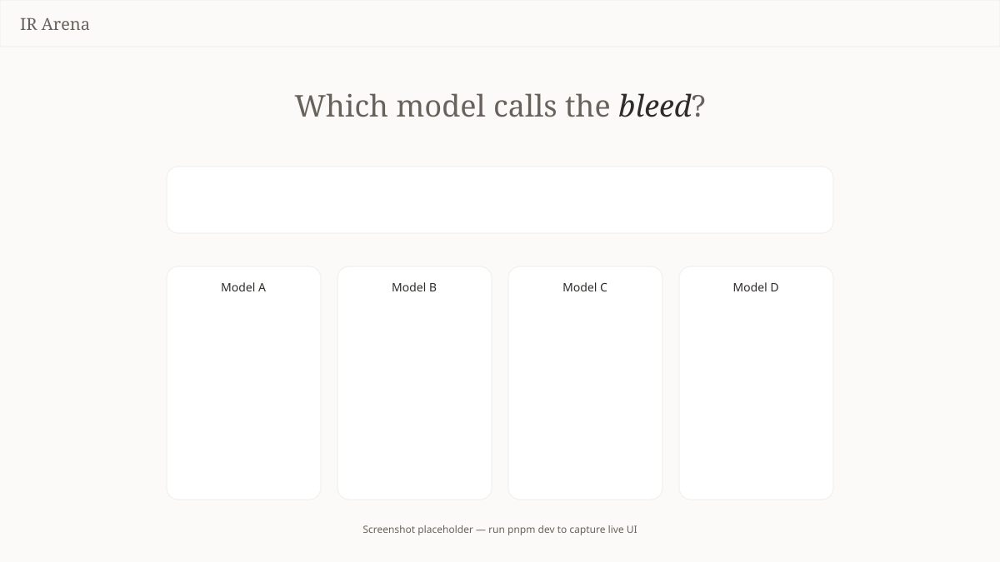

# IR Arena

Blinded side-by-side LLM triage comparison for synthetic acute hemorrhage cases — a research demo for interventional radiology.



## Quickstart

```bash
cp .env.example .env.local   # add AI_GATEWAY_API_KEY
pnpm i && pnpm dev           # http://localhost:3000
```

Only `AI_GATEWAY_API_KEY` is required. Four frontier models stream structured IR triage advice in parallel via [Vercel AI Gateway](https://vercel.com/ai-gateway).

## Demo script

1. Select preset **#2 Pelvic trauma**
2. Click **Run Triage** (blinded Model A–D)
3. Toggle **Reveal models** and review the **Consensus** strip

## Stack

Next.js · Tailwind CSS v4 · shadcn/ui · AI SDK v6 · Vercel AI Gateway · Zod

## Docs

See [`docs/PROJECT.md`](./docs/PROJECT.md) for architecture and [`design.md`](./design.md) for visual spec.